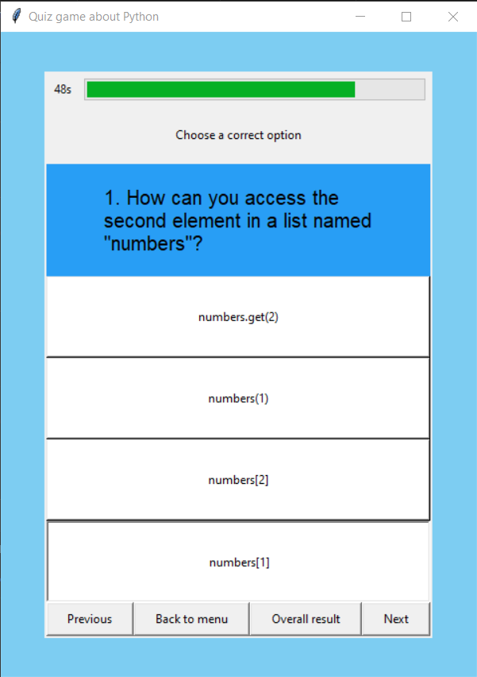

# PythonQuizApp
This project is a Python-based quiz application developed as an assignment for university coursework. The graphical user interface (GUI) library used for this project is Tkinter.

## Screenshots

